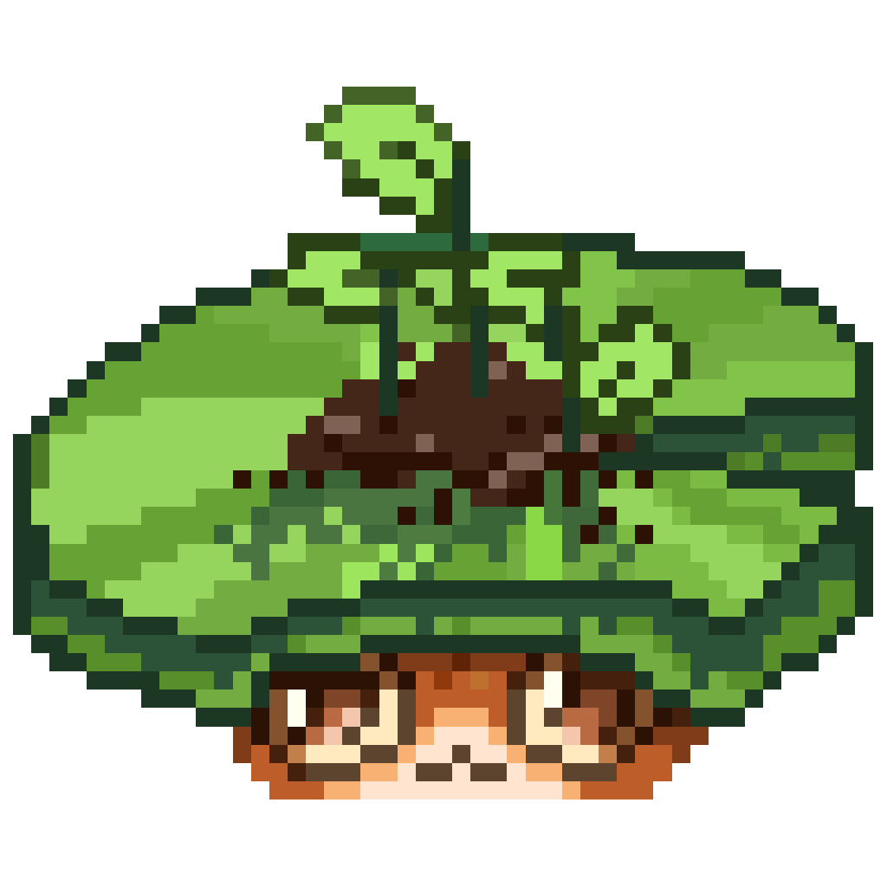
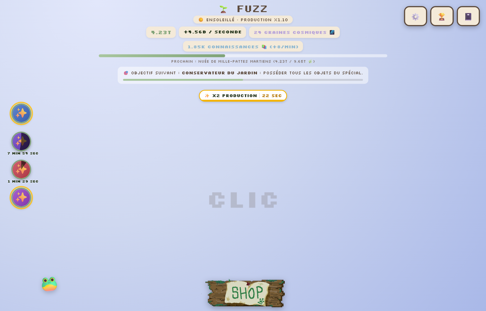
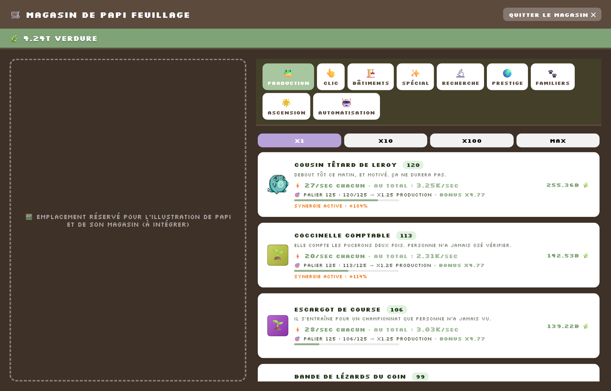
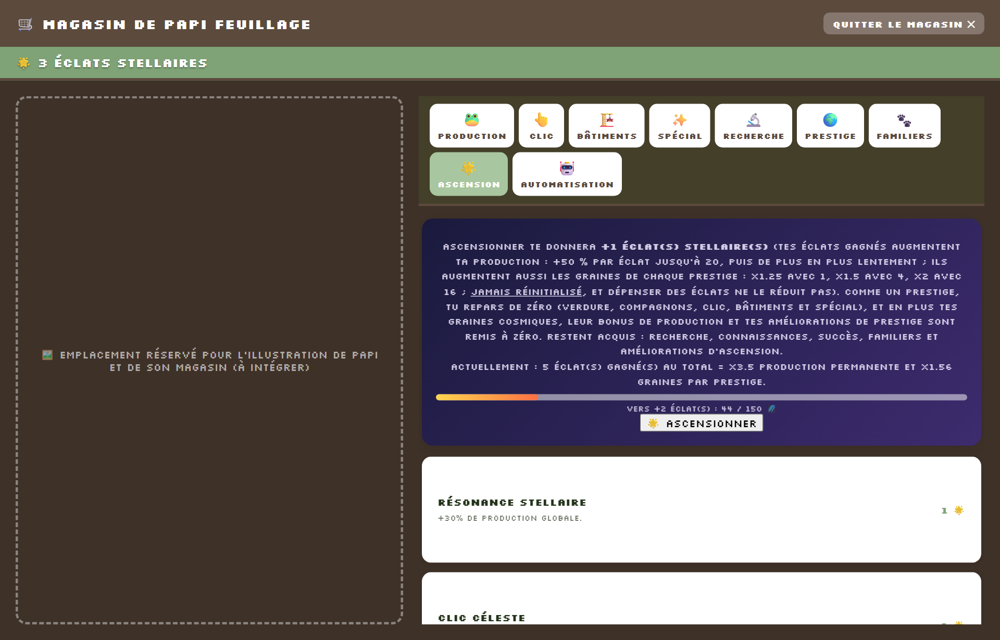

<p align="center">
  
</p>

<h1 align="center">FUZZ</h1>

<p align="center">
  Un jeu de jardinage incrémental : tu désherbes, tu embauches des grenouilles, et un jour tu terraformes tout.<br>
  Application native pour Windows, macOS et Linux. Français et anglais.
</p>

<p align="center">
  
</p>

## L'histoire

Papi Feuillage a « mystérieusement » hérité d'un terrain vague. Trop occupé pour s'en occuper, il
en confie les clés à son petit-fils au chômage, Leroy. C'est toi.

Papi repasse régulièrement pour commenter, expliquer, et te rappeler que ton cousin Bramble, lui,
a déjà trois terrains et un yacht.

## Télécharger et jouer

Va dans [Releases](https://github.com/TomRolling/FUZZ/releases) et prends le fichier de ton système :

| Système | Fichier |
|---|---|
| Windows | `.msi` ou `.exe` |
| macOS | `.dmg` |
| Linux | `.deb` ou `.AppImage` |

Une fois installé, le jeu se met à jour tout seul : il propose la nouvelle version au lancement.
Ta partie est enregistrée sur ton ordinateur, et les Options permettent de l'exporter, de
l'importer, ou de revenir à la partie d'avant un import.

## Ce qu'on y fait

Tu commences en cliquant sur le jardin. Au bout de 200 clics, Papi ouvre son magasin, et chaque
nouveauté t'est présentée au moment où elle arrive.

<p align="center">
  
</p>

- **Production** : 34 compagnons, du Cousin têtard de Leroy à l'Esprit de la Mare Infinie. Chacun
  produit tout seul, même quand le jeu est fermé.
- **Clic** : des améliorations pour ceux qui aiment cliquer.
- **Bâtiments** : achetés une seule fois, chacun améliore un compagnon précis.
- **Spécial** : des objets uniques, surtout des capacités à déclencher, avec leur temps de recharge
  affiché à gauche de l'écran.
- **Recherche** : payée en Connaissances, qui arrivent au rythme d'une par minute, quoi que tu fasses.
- **Familiers** : cinq compagnons de route (escargot, grenouille, chouette, hérisson, abeille), un
  seul actif à la fois, que tu fais monter en niveau.
- **Automatisation** : achats, capacités et Prestige automatiques, offerts au fil de la progression.
- **Défis, quêtes, bonus du jour, succès et galerie** pour le reste.

Sans oublier la météo, les mauvaises herbes dorées, les nuées de papillons, et les visites de Papi
qu'il faut écourter en cliquant.

### Recommencer plus fort

<p align="center">
  
</p>

- **Prestige** : tu repars de zéro (Verdure, compagnons, Clic, Bâtiments, Spécial) et tu gagnes des
  **Graines Cosmiques**, qui augmentent ta production pour toujours et achètent des améliorations
  permanentes.
- **Ascension** : un cran au-dessus. Tu perds aussi tes Graines, mais tu gagnes des **Éclats
  Stellaires**, qui augmentent ta production et les Graines de chaque Prestige suivant.

Pour donner une idée du rythme : environ 15 heures de jeu jusqu'au premier Prestige, 3 jours et
demi jusqu'à la première Ascension, et près de trois semaines pour posséder tout le contenu.

## Pour développer

Le jeu entier (HTML, CSS et JavaScript) tient dans un seul fichier, [dist/index.html](dist/index.html).
Il n'y a ni framework, ni bundler, ni étape de compilation côté jeu : Tauri ouvre simplement une
fenêtre native sur ce fichier. Le même fichier fonctionne aussi tel quel dans un navigateur.

```
dist/index.html      tout le jeu
dist/assets/         images, sons, polices
src-tauri/           coquille native (Rust, config Tauri, icônes)
tests/               tests automatiques et banc d'équilibrage
docs/captures/       images de ce README
```

### Lancer et construire

```bash
npm install            # une fois : installe le CLI Tauri
npm run tauri dev      # ouvre le jeu dans une fenêtre native
npm run tauri build    # construit l'installeur pour ton système
```

Pré-requis : [Node.js](https://nodejs.org) 18 ou plus, et [Rust](https://rustup.rs). Sous Linux,
il faut aussi `libwebkit2gtk-4.1-dev`, `libssl-dev`, `librsvg2-dev`, `patchelf`, `build-essential`,
`libxdo-dev` et `libayatana-appindicator3-dev`. Sous macOS, les outils en ligne de commande Xcode.
Sous Windows, « Desktop development with C++ » des Build Tools de Visual Studio.

Pour régénérer toutes les icônes depuis l'image source : `npx tauri icon app-icon-source.png`.

### Tests et équilibrage

Les tests pilotent le vrai jeu dans un navigateur, avec Playwright. Voir [tests/README.md](tests/README.md).

```bash
cd tests
npm install && npx playwright install chromium   # une fois
bash tout.sh                  # toute la suite (environ 15 min)
node test-fluidite.js         # un seul test
```

Le banc d'équilibrage fait jouer un bot sous horloge virtuelle et sort un rapport : moment de
chaque déblocage, temps morts, part de chaque source de revenus.

```bash
cd tests
node banc.js ./equilibre-jeu-paliers.js attentif 42 150   # début de partie
node banc.js ./equilibre-fin.js attentif 42 600           # jusqu'à la fin du contenu
```

### Mode test caché

Dans le jeu, **Ctrl + Maj + D** ouvre un panneau qui permet d'avancer le temps, d'accélérer le jeu,
de s'offrir des ressources, de déclencher les événements, de forcer un Prestige ou une Ascension,
de tout débloquer, ou de faire rejouer à Papi toutes ses présentations.

### Publier une version

1. Change `"version"` dans [src-tauri/tauri.conf.json](src-tauri/tauri.conf.json). C'est ce numéro
   que la mise à jour automatique compare.
2. Commite, puis pousse un tag :
   ```bash
   git tag -a v0.7.0 -m "Version 0.7.0"
   git push origin main && git push origin v0.7.0
   ```
3. GitHub construit les trois systèmes en parallèle et crée une **release en brouillon** avec les
   installeurs et un `latest.json` signé. Relis-la, puis publie-la : tant qu'elle est en brouillon,
   personne ne reçoit la mise à jour.

Le workflow [.github/workflows/build.yml](.github/workflows/build.yml) peut aussi être lancé à la
main depuis l'onglet Actions, sans tag : il construit sans rien publier.

<details>
<summary>Clés de signature des mises à jour (déjà configurées)</summary>

Tauri exige que chaque mise à jour soit signée, sinon les installations existantes la refusent. La
clé publique est dans `tauri.conf.json` (`plugins.updater.pubkey`), et la clé privée vit dans les
secrets GitHub du dépôt, sous `TAURI_SIGNING_PRIVATE_KEY` et `TAURI_SIGNING_PRIVATE_KEY_PASSWORD`.

Pour refaire une paire de clés (seulement si la clé privée est perdue, ce qui casse la mise à jour
automatique pour tous les joueurs déjà installés) :

```bash
npx tauri signer generate -w ~/.tauri/fuzz.key
```

La commande affiche la clé publique à recopier dans `tauri.conf.json`, et demande un mot de passe
à enregistrer dans les secrets GitHub avec le contenu du fichier `.key`.
</details>

## À savoir

- Les images de certains objets de fin de partie sont provisoires : elles sont générées
  automatiquement, en attendant de vraies illustrations.
- Le service worker (`sw.js`) ne sert qu'à la version web installable. L'application native
  l'ignore, le jeu le détecte tout seul.

## Crédits

Jeu créé par Tom Rolling. Développement assisté par Claude (Anthropic).
